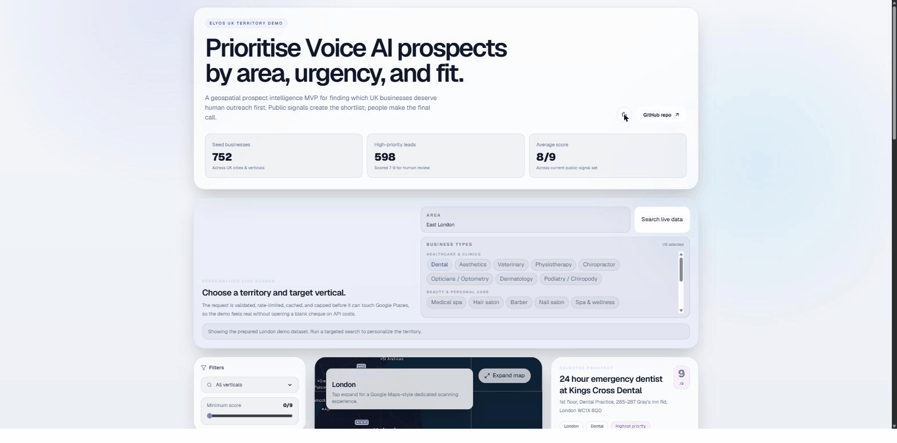

# Voice AI Prospect Map

A full stack map app that helps a Voice AI company decide which local businesses are worth contacting first.

Live demo: https://voice-ai-prospect-map.vercel.app  
Access is gated. Credentials are available on request.



## What it does

The app searches real UK businesses from Google Places, scores each one from 0 to 9 for AI receptionist fit, and shows the results on a ranked map.

For each prospect it can generate an AI brief with:

* why the business looks like a good or bad fit
* the likely call handling or booking pain
* a suggested outreach angle
* an admin only deep research mode that reads the business website before writing the brief

The point is not just to show another chatbot. It is a small working GTM tool for a specific buyer: Voice AI companies selling phone reception, appointment booking and customer service automation.

## Main features

* Live Google Places search across 24 UK business categories
* Explainable 0 to 9 scoring rubric, not a black box score
* Google Map with ranked markers, filters and a shortlist panel
* OpenAI prospect analysis cached in Postgres to avoid repeated token spend
* Admin only deep research for more expensive website grounded briefs
* Upstash Redis for shared rate limits and short lived Places search caching
* Two access tiers: demo and admin
* Review queue for saving follow up notes and decisions
* Light and dark mode

## Tech stack

* Next.js 16 App Router
* React 19
* TypeScript
* Tailwind CSS v4
* Prisma 7 with Supabase Postgres
* Google Places API and Google Maps JavaScript API
* OpenAI API
* Upstash Redis
* Vercel

## How it works

1. The user searches by UK area and selected business categories.
2. The server calls Google Places with a UK restriction.
3. Each result is normalised into a business record.
4. A deterministic scoring model rates the business using public signals like category, reviews, phone availability, website friction and appointment complexity.
5. Results are persisted in Supabase through Prisma.
6. AI enrichment runs only on demand and is cached with a cooldown.
7. Redis rate limits expensive endpoints and caches repeated Places searches across serverless instances.
8. The UI renders the ranked list, map markers, filters and review queue.

## Cost controls

This was built with token and API cost in mind:

* standard AI analysis is cached in the database
* deep research is only available to admin users
* repeated Places searches are cached in Redis for 30 minutes
* expensive endpoints have shared rate limits
* the app uses a low cost OpenAI model by default

## Local setup

```bash
npm install
cp .env.example .env.local
npm run db:push
npm run dev
```

Fill `.env.local` with your own provider keys. Real credentials should stay in Vercel environment variables and local `.env.local`, never in committed docs.

Useful checks:

```bash
npm run lint
npm test
npm run build
```

If you change the scoring rubric, re score stored businesses:

```bash
npm run db:rescore
```

## Environment variables

See `.env.example` for the full list. The important split is:

* server only: database URL, OpenAI key, Google Places key, Redis token and gate passwords
* browser safe: `NEXT_PUBLIC_GOOGLE_MAPS_API_KEY`, restricted by HTTP referrer in Google Cloud

Only variables prefixed with `NEXT_PUBLIC_` are bundled into browser code.

## Docs

* `ROADMAP.md`: future ideas
* `PROJECT_CONTEXT.md`: private working context, not meant for the public repo
* `docs/HANDOFF.md`: private agent handoff, not meant for the public repo
