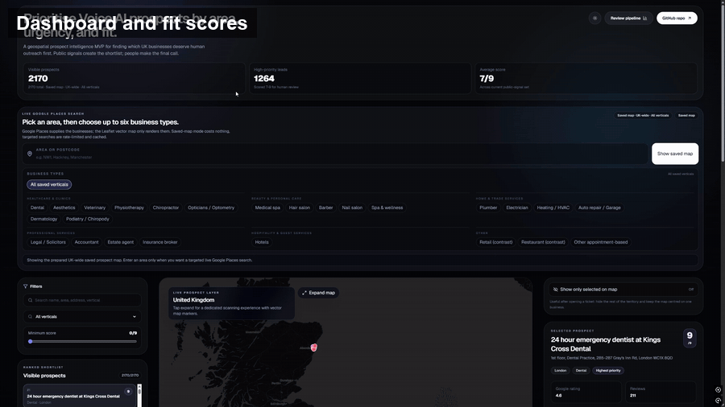

# Voice AI Prospect Radar

A gated prospect-intelligence map for Voice AI teams. It helps answer a practical go-to-market question: which local businesses are most likely to benefit from AI call handling, appointment booking, reminders, and customer-service automation?

Live demo: https://voice-ai-prospect-map.vercel.app  
Access is gated. Credentials are available on request.

Current walkthrough: dashboard, saved UK map, AI prospect brief, live Places search, and review pipeline.

This repository is a showcase copy for discussing the product, UX, and engineering judgement behind the work. It is not packaged or maintained as an open-source product, and the implementation notes here are intentionally high level rather than a full operator playbook.

## Why I built this

Voice AI vendors do not just need a list of local businesses. They need to know which businesses are likely to have missed-call, booking, receptionist, or customer-service pain, and which ones are worth human outreach first.

This project turns that go-to-market problem into a working workflow: search a territory, score local businesses, map the opportunity, generate a prospect brief, and save follow-up decisions.

## What it does

- Searches real UK local businesses across 24 business categories.
- Scores each business from 0 to 9 for Voice AI fit using explainable public signals.
- Shows ranked prospects on a fast interactive map with shortlist, filters, and an expanded map view.
- Lets reviewers refine the saved or current result set by business name, area, address, vertical, use case, review signals, and score.
- Explains each score with a visible signal breakdown rather than hiding the ranking behind a black-box AI model.
- Generates an AI-written prospect brief and outreach angle on demand.
- Supports an admin-only deeper research mode that can use public website text when available.
- Saves review decisions in a ticket pipeline with drag-and-drop status changes and quick business-context popups.
- Exports structured prospect context for a separate voice-agent scenario lab.
- Supports light and dark themes with responsive desktop, ultrawide, and map-focused layouts.
- Defaults to a saved all-vertical map so demos can browse the territory without spending live search calls.

## What this demonstrates

- Turning a vague GTM idea into a deployed AI product workflow.
- Combining real-world business discovery, geospatial UX, explainable scoring, AI enrichment, and review operations.
- Designing deterministic ranking logic instead of relying on opaque AI judgement.
- Keeping the expensive AI path controlled through access tiers, caching, cooldowns, and rate limits.
- Separating business discovery from map rendering so the UI stays responsive as result sets grow.
- Handling a realistic private-build/public-showcase split without exposing credentials, internal notes, or the full operating recipe.
- Shipping a stakeholder-friendly interface, not just a backend script or chatbot.

## Demo flow

1. Open the saved all-vertical prospect map.
2. Select a high-scoring business and inspect the score breakdown.
3. Generate an AI prospect brief and outreach angle.
4. Run a targeted live search for a UK area and selected verticals.
5. Refine the current result set by text search, vertical, and minimum score.
6. Open or reject review tickets for follow-up.
7. Move tickets through the outreach pipeline and reopen saved business context from any ticket card.
8. Copy a structured sandbox brief for a selected prospect.

## How it works

At a high level, the app has four layers:

- a responsive browser experience for searching, mapping, filtering, and reviewing prospects
- server-side routes that coordinate saved data, live search, AI enrichment, auth state, and ticket updates
- a persistent store for businesses, generated briefs, and review tickets
- external business-data, AI, caching, and hosting services

The exact provider wiring, version list, environment variables, and deployment setup are intentionally omitted from this public-facing README. The goal here is to show the product and engineering shape without publishing the entire build recipe.

The ranking itself is deterministic. AI is reserved for explanatory prospect briefs and outreach angles, which keeps the score inspectable and makes the cost profile easier to control.

## Scoring model

The 0 to 9 score is based on public signals such as:

- category fit for Voice AI use cases
- call dependency
- appointment or scheduling complexity
- website and online-booking friction
- review volume as a demand proxy
- public rating and review-volume friction proxies
- confidence penalties for missing public data

The score is intentionally explainable. The UI shows why a prospect ranked highly instead of asking the user to trust a black-box AI score.

## AI enrichment

AI is used on demand to generate:

- a short prospect summary
- the likely operational pain
- a practical outreach angle
- optional admin-only deeper research using public website text when available

Generated output is cached and reused with a cooldown so repeated demo clicks do not create unnecessary cost.

## Access and controls

- The live demo is gated.
- Admin and demo users have different access levels.
- Demo users cannot access deeper research.
- Expensive endpoints are protected with rate limits and cache layers.
- Provider credentials and operational details stay in private environment configuration, not committed docs.

## Current status

This is ready as a portfolio MVP: deployed, gated, backed by real UK business data, and built with controls around expensive AI and live-search paths.

The remaining work is product expansion rather than launch cleanup:

- add stronger postcode-aware territory search for full UK postcodes and outward codes such as `NW1`
- build a larger saved prospect database through controlled offline ingestion
- connect the exported sandbox brief to a separate voice-agent scenario lab
- optionally add an ungated public demo mode with stricter quotas
- add browser smoke tests for the map, filters, theme toggle, and ticket workflow

## Roadmap

See [`ROADMAP.md`](ROADMAP.md) for future improvements. The current build is intentionally scoped as a portfolio MVP: strong enough to demo the workflow, but not pretending to be a finished commercial product.

## Case study

See [`CASE_STUDY.md`](CASE_STUDY.md) for the product framing, tradeoffs, and resume-safe project summary.
